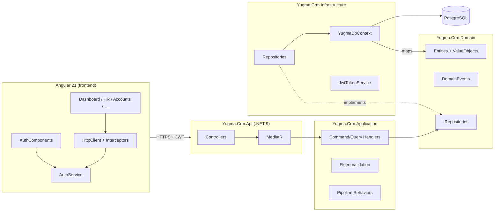
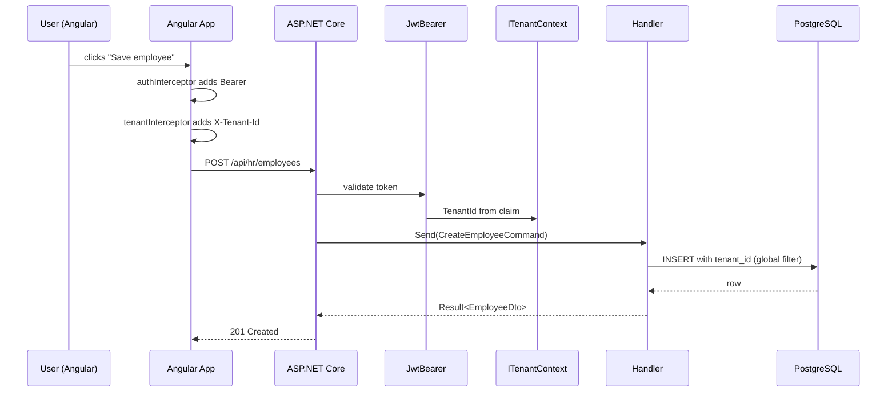
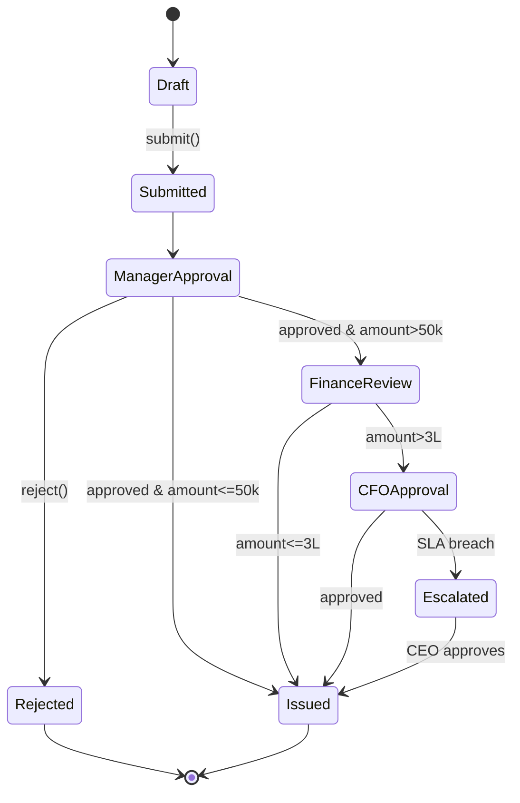

# Diagrams

ASCII / Mermaid diagrams. Paste any block into <https://mermaid.live> to render.

## Solution map



## Tenant request



## Workflow lifecycle



## Frontend route tree

```mermaid
flowchart TB
  R[/] --> A[/auth]
  A --> Login[login]
  A --> Reg[register]
  A --> Fp[forgot]
  A --> Otp[otp]
  A --> Mfa[mfa]
  R --> Shell[AppShell (guard: auth)]
  Shell --> D[/dashboard]
  Shell --> HR[/hr]
  HR --> Emps[/employees]
  Emps --> EmpsNew[/new]
  Emps --> EmpDet[/:id]
  HR --> Att[/attendance]
  HR --> Lv[/leave]
  HR --> Pr[/payroll]
  HR --> Rc[/recruitment]
  HR --> Pf[/performance]
  HR --> HrA[/analytics]
  Shell --> Acc[/accounts]
  Shell --> Mat[/material]
  Shell --> Wf[/workflow]
  Shell --> Rep[/reports]
  Shell --> Not[/notifications]
  Shell --> Us[/users]
  Shell --> Cfg[/configuration]
  Shell --> Au[/audit]
  Shell --> AI[/ai-assistant]
  Shell --> St[/settings]
```
